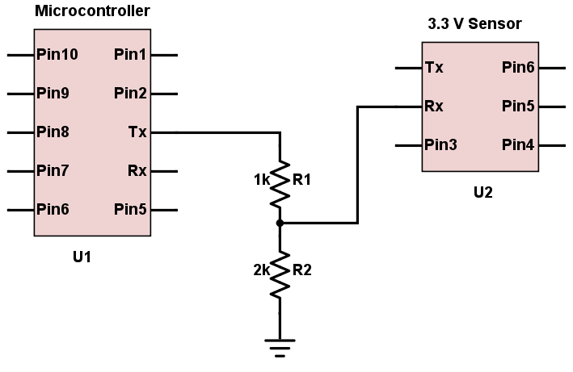

# Bill of Materials

List of parts used for project

- esp32 (original)
- HC-SR04 Ultrasonic sensor
- BME280 Temperature, Humidity, Pressure
- ADS1115 ADC and amplifier
- Oxygen Sensor
- OLED Display

## ESP32

- [Datasheet](./Device%20Info/esp32/esp32_datasheet_en.pdf)
- [Pinout Diagram](./Device%20Info/esp32/esp32-devkitC-v4-pinout.png)

## HC-SR04
[Datasheet](./references/device%20data/HC-SR04_ultrasonic/HC-SR04_datasheet_en.pdf)
### Voltage Divider
This device requires a 5 V input, and a voltage divider is used to reduce echo pin signal to 3.3V for communication with the esp32. The trigger pin can accept both 5 V and 3.3 V signals and therefore does not require any additional elements.

**Calculation**

$V_{out} = V_{in} \cdot \frac{\normalsize R_2}{\normalsize R_1 + R_2}$

$V_{out}$ is based on the ratio of the resistance, the magnitude of the resistors is chosen based on the current or signal speed requirements. For this application, as fast signal transfer is desired, resistor values selected were: 
- $R_1 = 1000\ Ω$ 
- $R_2 = 2000\ Ω$ 

[source - allaboutcircuits.com](https://www.allaboutcircuits.com/tools/voltage-divider-calculator/)

## BME280 Temperature, Humidity, Pressure

## ADS1115 ADC and amplifier

## Oxygen Sensor

## OLED Display
